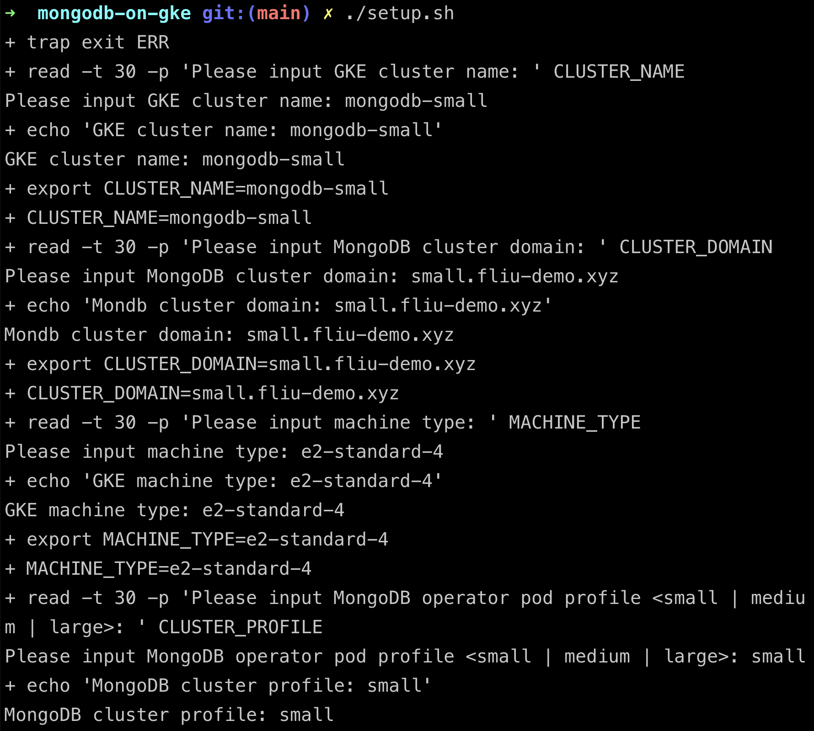
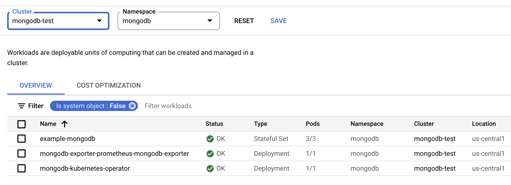

# Description
The main purpose for this repo to provide a solution for MongoDB on GKE by leveraging GCP services, like GKE, cloud build, terraform, Managed Prometheus Service and etc.

# Supported Features
- Create GKE cluster, you can specify below parameters for your customized deployment
  - Project
  - Region
  - Machine type
  - (WIP) MongoDB pod profile (CPU/Memory/Disk)
- Install MongoDB community operator
- Install MongoDB exporter for `Managed Prometheus Service`
- Install Velero, pre-create a backup for MongoDB instance

# 0. Setup environment
```
gcloud auth login
gcloud config set project <PROJECT_ID>
```

# 1. Clone this repo to your local
```
git clone https://github.com/cloudymoma/mongodb-on-gke.git
cd mongodb-on-gke
./setup.sh
```
Specify a GKE cluster name, cluster domain name for MongoDB, and machine type for GKE node. <B>(Notes that you need to machine type with >= 4vCPU at least)</B>


# 2. Wait for about 20 minutes until cloud build job completes

### Go to GCP console, check the GKE cluster


### Verify machine type as you specified


### Check the workloads in namespace `mongodb`


### Verify metrics in `Managed Service for Prometheus`


### Velero for backup & restore

